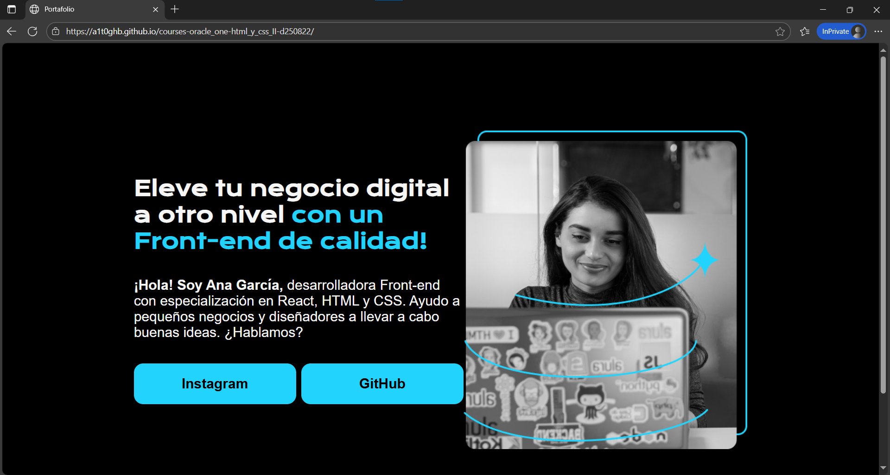
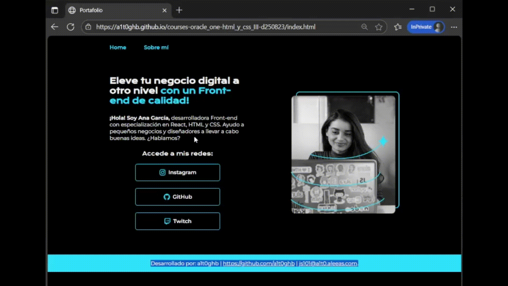

<!-- Badges:
- Source: 'https://shields.io/docs/static-badges', 'https://shields.io/badges/static-badge'.
- HTML structure followed: 'https://github.com/facebook/docusaurus/blob/main/README.md?plain=1'.
- Badges with logos: 'https://shields.io/docs/logos', 'https://simpleicons.org/', 'https://github.com/simple-icons/simple-icons/blob/master/slugs.md'.
- HTML <a> tag not redirecting: 'https://stackoverflow.com/questions/8260546/make-a-html-link-that-does-nothing-literally-nothing/8260561#8260561', 'https://www.geeksforgeeks.org/html/how-to-create-html-link-that-does-not-follow-the-link/'.
-->

<!-- Badge: WIP

  

-->
<!--
🚧 WIP: section under construction. 🚧
-->

<!-- Badge: Done -->

  

<!-- README structure followed:
- 'https://www.aluracursos.com/blog/como-escribir-un-readme-increible-en-tu-github/'.
- 'https://github.com/camilafernanda/GlicoCare/'.
- 'https://github.com/nasa/openmct/'.
- 'https://github.com/facebook/docusaurus'.
-->

# Basics of HTML and CSS (III).

  🌐 '<a href="https://a1t0ghb.github.io/courses-oracle_one-html_y_css_III-d250823/">https://a1t0ghb.github.io/courses-oracle_one-html_y_css_III-d250823/</a>'

<!--
Enable autoplay of animated images:
- 'https://stackoverflow.com/questions/72508378/enable-gif-autoplay-on-github-readme/72509078#72509078'.
- 'https://github.com/orgs/community/discussions/47709'.
- 'https://github.com/settings/accessibility'.
Image width for GitHub READMEs:
- 'https://github.com/orgs/community/discussions/42424'.
- 'https://gist.github.com/uupaa/f77d2bcf4dc7a294d109'.
-->
<!-- 

    

 -->

    

Final delivery of the 9th course: '[HTML y CSS: header, footer y variables CSS](https://app.aluracursos.com/course/html-css-header-footer-variables-css)', from module (a.k.a. 'formación' in spanish) '[Principiante en Programación G9 - ONE](https://app.aluracursos.com/formacion-programacion-primeros-pasos-grupo9-one)', of [Alura LATAM](https://www.aluracursos.com/). <b>Part of [ORACLE Next Education (ONE)](https://www.oracle.com/co/education/oracle-next-education/) education program, in LATAM</b>.

<!-- Callouts:
- Improved format taken from examples in 'https://github.com/nasa/openmct/blob/master/README.md?plain=1'.
-->
> [!NOTE]
> This README is **mainly** written in english (en), but it might have some sections in spanish (sp), since course content is in spanish.

# ℹ About.

The course covered topics such as:

- Importance of keep an organized structure for files and folders.
- Using icons as images inside `<a>` tags.
- Digging into ['flexbox'es](https://css-tricks.com/snippets/css/a-guide-to-flexbox/) settings; e.g. `flex-direction`: row vs. columns.
- Working with CSS classes for mouse hovering; e.g. `.<custom_css_class>:hover { ...; }`.
- Working with HTML semantic tags `<header>` and `<footer>`.
- Creating new HTML pages, to link **from main HTML file** `index.html`.
    - Referring to other pages, using `<a>` tags; e.g. `<a class="header-menu-link" href="./about.html">Sobre mí</a>`.
- Working with [CSS variables](https://www.w3schools.com/css/css3_variables.asp) for code optmization and efficiency.

## 🥇 Course Certificate of Completion.

Available at '<https://app.aluracursos.com/certificate/4330d460-f8b3-470c-a33b-c56180ad2066>'.

- Estimated workload: 6h.
- Activities: 45.
- Topics:
    1. 'Preparando el layout del proyecto'.
    2. 'Creando iconos clicables'.
    3. 'Creando el header y el footer'.
    4. 'Navegando entre páginas'.
    5. 'Aplicando las variables CSS'.

## 🔗 Links to program resources.

**PROGRAM STRUCTURE.**

- <b>*[Course]* 'HTML y CSS: header, footer y variables CSS'</b>: '<https://app.aluracursos.com/course/html-css-header-footer-variables-css/>'.
- *[Module]* 'Principiante en Programación G9 - ONE': '<https://app.aluracursos.com/formacion-programacion-primeros-pasos-grupo9-one/>'.
- **ORACLE Next Education (ONE) education program, in LATAM**: '<https://www.oracle.com/co/education/oracle-next-education/>'.
- Alura LATAM education platform: '<https://www.aluracursos.com/>'.

**COURSE RESOURCES.**

- GitHub's project repository: '<https://github.com/alura-es-cursos/2080-html-css-header-footer-variables/>'.
- Figma's frontend to emulate (updated): '<https://www.figma.com/design/EAQgNcBE5qOCn5qFFYZzNZ/Portafolio---Curso-3>'.

<!-- Embed dynamic content (image) of contributors:
- 'https://dev.to/lacolaco/introducing-contributors-img-keep-contributors-in-readme-md-gci'.
- 'https://contrib.rocks/'.
-->
# 🤝 Contributors.

Made with [contrib.rocks](https://contrib.rocks).

<!-- Authors table structure
- From repo: 'https://github.com/camilafernanda/GlicoCare/blob/main/README.md?plain=1'.
-->
# 📜 Authors.

| [ a1t0ghb](https://github.com/a1t0ghb) |
| :---: |
